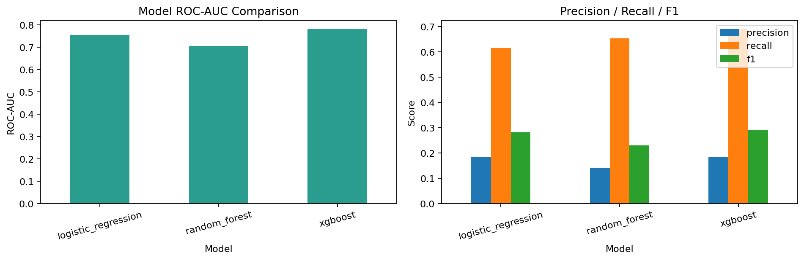
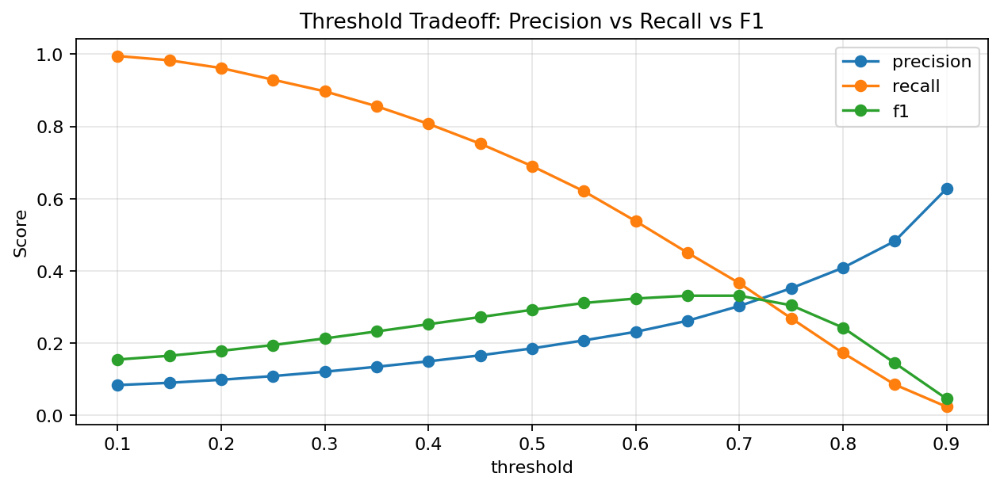
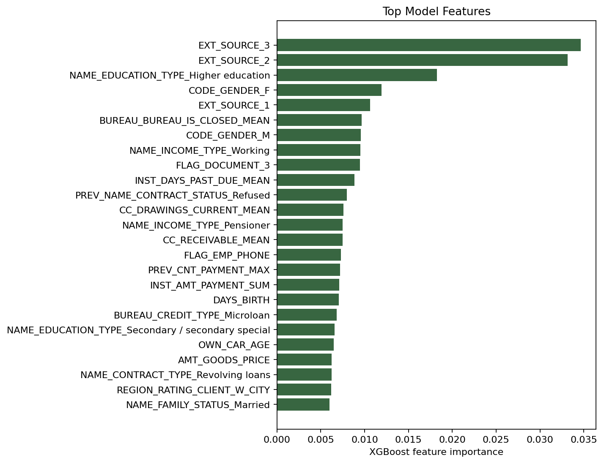

# Credit Risk Loan Default Prediction

A machine learning project based on the Home Credit Default Risk dataset from Kaggle. The goal is to predict whether a borrower is likely to default on a loan using customer application data and historical credit records.

**Dataset:** [Home Credit Default Risk](https://www.kaggle.com/competitions/home-credit-default-risk)

## Objective

The objective of this project is to predict loan default risk using customer application data and historical credit records. The project explores feature engineering from multiple related tables and compares several machine learning models for binary classification.

## Tech Stack

- Python
- Pandas
- NumPy
- Scikit-learn
- XGBoost
- Matplotlib
- Streamlit

## Project Structure

- `data/raw/home_credit/`: Kaggle competition data
- `data/processed/`: processed artifacts for demos
- `models/`: saved model pipelines
- `reports/`: model comparison and threshold analysis outputs
- `MODEL_CARD.md`: model purpose, limitations, metrics, and responsible-use notes
- `notebooks/`: EDA notebook for presentation
- `src/`: training, feature engineering, and evaluation code
- `app.py`: Streamlit demo application

## Modeling Workflow

1. Load `application_train.csv` as the core borrower table
2. Aggregate behavioral features from:
   - `previous_application.csv`
   - `bureau.csv`
   - `bureau_balance.csv`
   - `installments_payments.csv`
   - `POS_CASH_balance.csv`
   - `credit_card_balance.csv`
3. Merge engineered features back to the main applicant table
4. Split into train and test sets with stratification
5. Train and compare:
   - Logistic Regression
   - Random Forest
   - XGBoost
6. Save the best-performing model
7. Tune thresholds to reflect different lending business priorities
8. Surface everything in a Streamlit demo
9. Generate feature importance artifacts for model explainability

## Current Results

Engineered dataset:

- Rows: `307,511`
- Columns: `324`
- Default rate: about `8.1%`

### Model Performance

| Model | Accuracy | Precision | Recall | F1 Score | ROC-AUC |
|---------|---------|---------|---------|---------|---------|
| Logistic Regression | 0.747 | 0.183 | 0.615 | 0.282 | 0.755 |
| Random Forest | 0.647 | 0.140 | 0.654 | 0.231 | 0.707 |
| XGBoost | 0.730 | 0.185 | 0.690 | 0.292 | 0.781 |


**Best Saved Model:** `models/home_credit_xgboost.joblib`

### Threshold Tuning

- Best F1 Threshold: `0.70`
- Business Threshold: `0.55`

The model achieved its highest F1 score at a threshold of 0.70. A lower threshold of 0.55 improves recall and may be preferable when minimizing missed defaults is more important than precision.

## Project Screenshots

### Model comparison



### Threshold tradeoff



### Feature importance



## Key Files

- [src/train_home_credit.py](src/train_home_credit.py): multi-table feature engineering, model training, and comparison
- [src/threshold_tuning.py](src/threshold_tuning.py): threshold tradeoff analysis
- [src/explain_model.py](src/explain_model.py): feature importance report for the best saved model
- [app.py](app.py): Streamlit demo
- [MODEL_CARD.md](MODEL_CARD.md): concise model card for responsible ML discussion
- [notebooks/home_credit_eda.ipynb](notebooks/home_credit_eda.ipynb): presentation-ready EDA notebook
- [reports/home_credit_model_comparison.json](reports/home_credit_model_comparison.json): saved model metrics
- [reports/home_credit_model_comparison.png](reports/home_credit_model_comparison.png): portfolio-ready model comparison visual
- [reports/home_credit_feature_importance.csv](reports/home_credit_feature_importance.csv): top model features
- [reports/home_credit_feature_importance.png](reports/home_credit_feature_importance.png): feature importance visual
- [reports/home_credit_threshold_summary.json](reports/home_credit_threshold_summary.json): recommended thresholds
- [reports/home_credit_threshold_tradeoff.png](reports/home_credit_threshold_tradeoff.png): threshold tradeoff visual for GitHub or slides

## How To Run

Install dependencies:

```bash
python -m pip install -r requirements.txt
```

Train models and generate artifacts:

```bash
python -m src.train_home_credit
```

Run threshold tuning:

```bash
python -m src.threshold_tuning
```

Generate model explainability artifacts:

```bash
python -m src.explain_model
```

Launch the Streamlit demo:

```bash
streamlit run app.py
```

